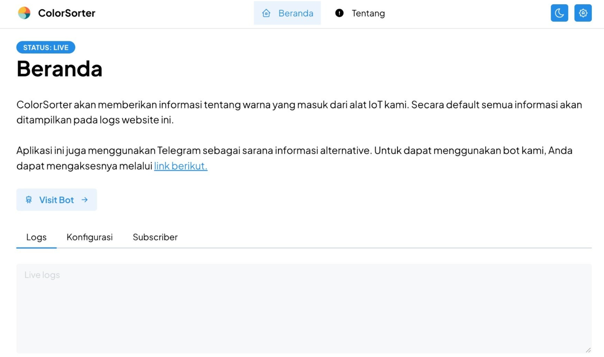
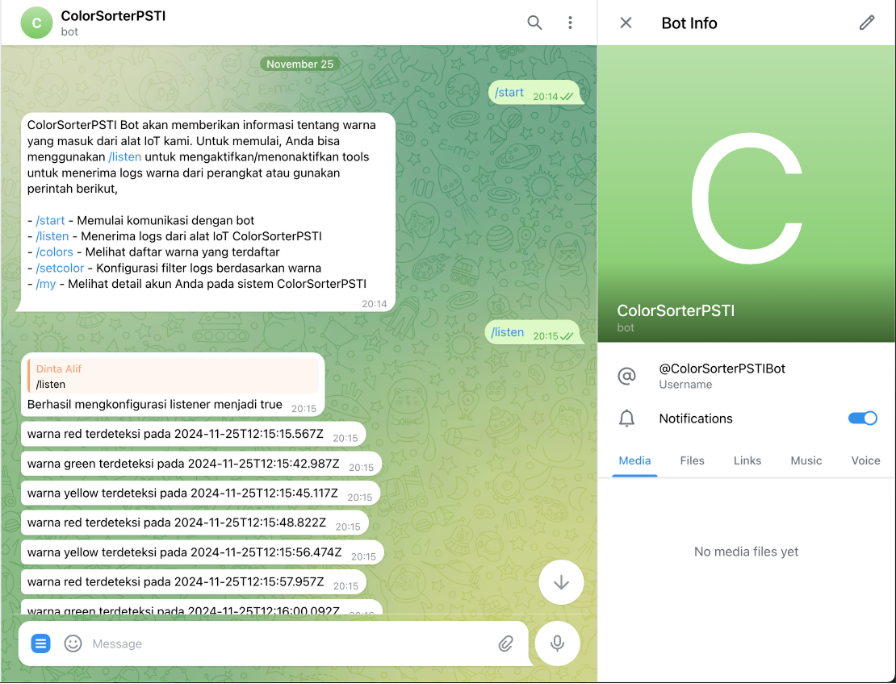
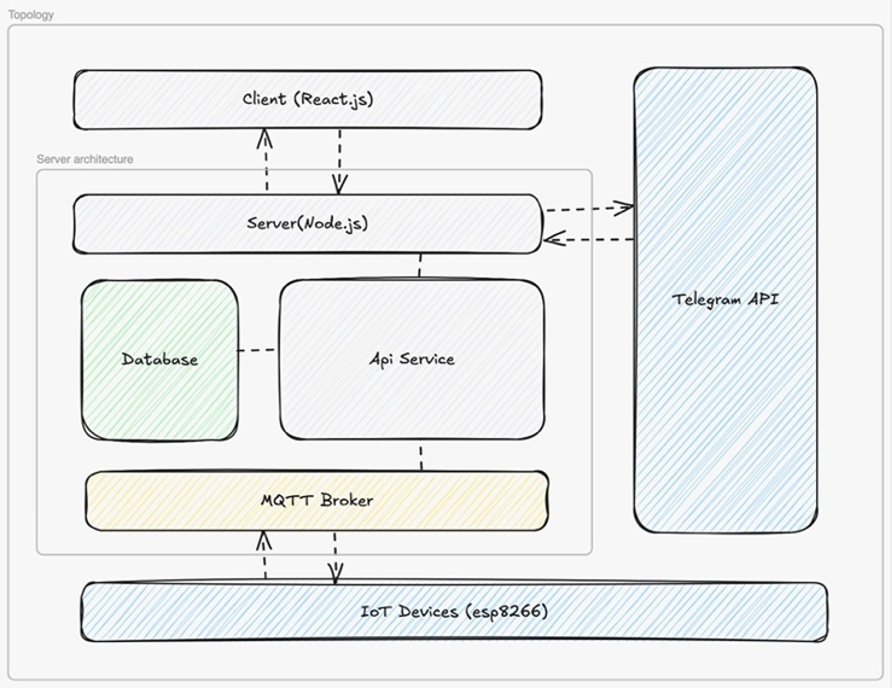

# Color Sorter

Integrating IoT with Web Platforms for Real-Time Control and Monitoring

This system connects an IoT-based color sorting machine with a website, enabling real-time monitoring, control, and data visualization. The integrated platform allows users to remotely adjust settings, track sorting performance, and view logs, making the color sorting process more efficient, accessible, and intelligent through modern digital interfaces.

## Preview

> Here is our demo

- [Demo](https://youtu.be/VgCMW_pBqNY?si=l5xYQJAujq_vUfF5)

## Requirements

### Hardware

| Component              | Minimum                                             | Recommended\*                                   | Maximum   |
| ---------------------- | --------------------------------------------------- | ----------------------------------------------- | --------- |
| CPU socket             | 1.3 GHz (64-bit processor) or faster for multi-core | 3.1 GHz (64-bit processor) or faster multi-core | 2 sockets |
| Memory (RAM)           | 8 GB                                                | -                                               | 64 GB     |
| Hard disks and storage | 10 GB hard disk with a 60 GB system partition       | -                                               | No limit  |

### Packages

- `node 20` or latest
- `python 3.12`
- `fastapi`, more detail docs [official website](https://fastapi.tiangolo.com/)
- `docker & docker compose`, more detail docs [official website](https://www.docker.com/)

## Installation

1. Open a terminal and go inside the main root folder
2. Run docker compose up -d
3. You can access localhost using default port, running at 3030
